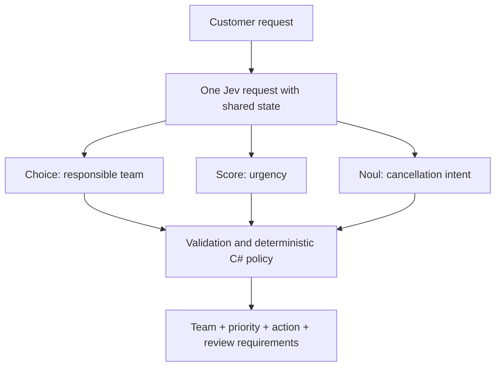
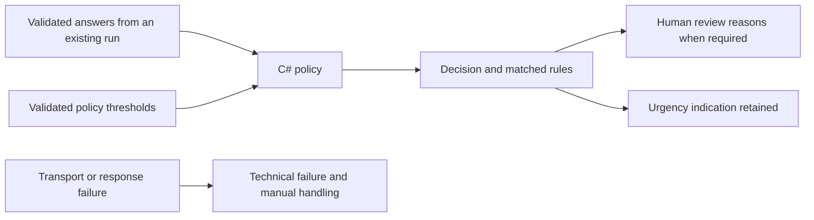
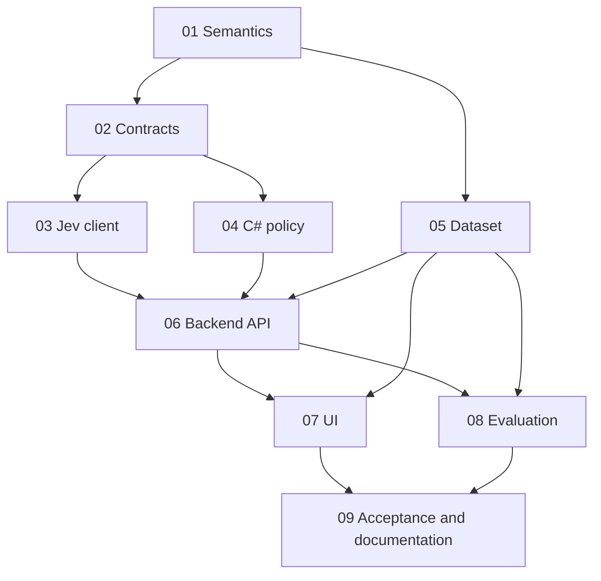

# Pipeline and task diagrams

## Original pipeline diagram

Arrows from the three judgments represent returned answers, not three HTTP requests. No judgment consumes another judgment's answer.

## Policy replay and human fallback

Replay has no path to Jev. The human fallback is a visible proposed handoff, not a new external ticketing system.

## Implementation dependencies

A dependency means **accepted completion with evidence**, not merely “another agent is working on it”. Task 09 owns final integration and the bundled frontend build.
